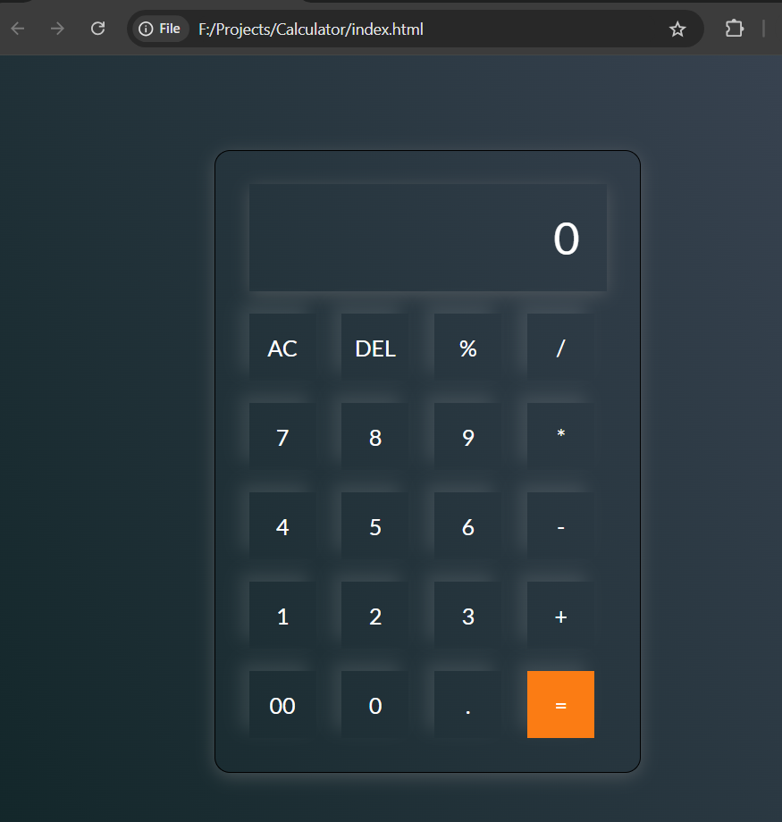

# Easy Calculator

## Overview

Easy Calculator is an online calculator application developed using vanilla JavaScript, HTML, and CSS. This project marks my first venture into web development using these technologies.

## Features

- Basic arithmetic operations: addition, subtraction, multiplication, and division.
- Clear (AC) button to reset the calculator.
- Delete (DEL) button to remove the last entered digit.
- Responsive and user-friendly interface.

## Demo

A screenshot of the SimpleCalculator:

## Usage

To use the SimpleCalculator, simply download or clone the repository and open the `index.html` file in your web browser.

## Project Structure

- `index.html`: The main HTML file that structures the calculator interface.
- `style.css`: The CSS file that styles the calculator.
- `script.js`: The JavaScript file that adds functionality to the calculator.

## Future Improvements

- Implementing scientific functions such as trigonometric operations, logarithms, etc.
- Adding keyboard support for input.
- Enhancing the user interface with animations and transitions.
- Including a history feature to display past calculations.
- Improving the overall design and user experience.

---

This project is my first attempt at creating a web application using vanilla JavaScript, HTML, and CSS. I appreciate any feedback and suggestions for improvement!

